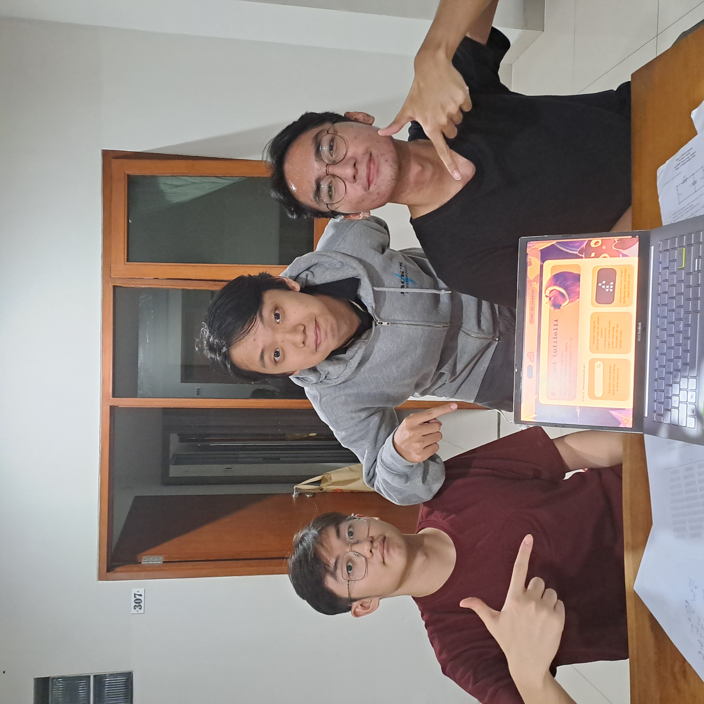

# Tugas Besar 2 - IF2211 Strategi Algoritma
> Pemanfaatan Algoritma BFS dan DFS dalam Pencarian Recipe pada Permainan Little Alchemy 2

## Kelompok 46 - BrBaloni Lulilolli

| NIM | Nama |
| :---: | :---: |
| 13523031 | Rafen Max Alessandro |
| 13523102 | Michael Alexander Angkawijaya |
| 13523112 | Aria Judhistira |

## Deskripsi Singkat
Little Alchemy 2 merupakan permainan berbasis logika dan eksplorasi melalui penggabungan unsur-unsur dasar untuk membentuk objek atau konsep baru. Pemain diminta untuk menemukan sebanyak mungkin elemen baru melalui kombinasi-kombinasi unik penggabungan dua elemen, diawali dengan empat elemen dasar: air, tanah, api, dan udara. Program ini dirancang menggunakan dua tipe pendekatan algoritma, Breadth First Search (BFS) dan Depth First Search (DFS), untuk membentuk algoritma dalam mencari jalur kombinasi / resep elemen dasar pembentuk elemen masukan pengguna. BFS adalah algoritma traversal graf yang menjelajahi graf berdasarkan tingkatannya, mengunjungi semua simpul pada satu kedalaman sebelum melanjutkan ke kedalaman berikutnya. DFS adalah algoritma traversal graf yang menjelajahi graf dengan menelusuri jalur sedalam mungkin terlebih dahulu, sebelum akhirnya menjelajahi cabang lainnya jika jalur sebelumnya tidak memberikan hasil.

## Dependencies

Sebelum memulai proyek, pastikan bahwa Anda sudah memiliki:
- [Golang](https://go.dev/)
- [Node.js](https://nodejs.org/en) versi 20 atau lebih
- [GNU Make](https://www.gnu.org/software/make/)

Sebagai alternatif, Anda dapat menginstall program menggunakan Dockerfile yang tersedia pada kedua repositori. Pastikan Anda memiliki [Docker Desktop](https://www.docker.com/products/docker-desktop/) dan silakan menjalankan perintah di bawah dan menyesuaikannya untuk kedua repositori:
```shell
docker build -t {nama_root_directory}
```

## Instalasi / Memulai

Untuk memulai proyek ini, silakan melakukan langkah-langkah berikut untuk masing-masing repositori frontend dan backend. 
<br>

### Repositori Frontend
Untuk repositori frontend:
```shell
git clone https://github.com/TukangLas21/Tubes2_FE_Brbaloni-Lulilolli.git
cd Tubes2_FE_Brbaloni-Lulilolli
npm install
```
Untuk menjalankan aplikasi frontend secara lokal, silakan memasukkan perintah berikut.
```shell
npm run dev
```
### Repositori Backend
Untuk repositori backend:
```shell
git clone https://github.com/angkaberapa/Tubes2_BE_BrBaloni-Lulilolli.git
cd Tubes2_BE_BrBaloni-Lulilolli
```
Untuk menjalankan program backend secara lokal, silakan memasukkan perintah berikut.
```shell
make run
```

## Aplikasi Deployment
Jika Anda ingin mengunjungi aplikasi web yang sudah di-deploy, silakan mengklik [link](https://tubes2-fe-brbaloni-lulilolli.vercel.app/) ini.

## Tautan Lainnya
Jika Anda tertarik, Anda dapat menonton video tentang proyek ini dengan mengklik [link](https://youtu.be/Klx4UGEPmcg?si=T1dQDLA9cmZi8MFc) ini.
